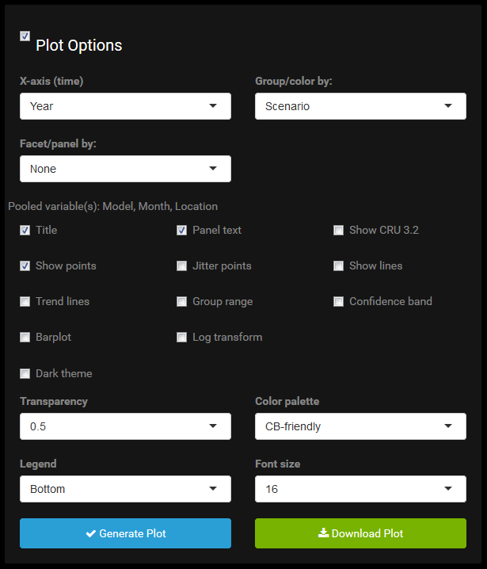

### Options Overload 

What are all these plot options? And why do they change when moving
across the navigation menu or updating the data selections?

#### Plot Options are Data-Dependent

Plot options depend on the data. This is trivial, but worth pointing out
because it's very easy to plot with a trigger finger and not give much
thought to *what* is being plotted. For instance, in the `Time Series`
plot, the x-axis is always time, and this is a completely independent
variable. The options in this menu are always the same, regardless of
data selection. Even if the user selects only one month and one year,
they can still plot using month, year, or decade as the x-axis variable.

However, the next menu for selecting a grouping variable, is dependent
on the data subset. Grouping is for factors and it's only sensible if
there are at least two levels of a factor in the data table. The menu,
among others, must be updated when the data changes. Some options are
hierarchically dependent. For example, the color options dpened on the
grouping variable which, for some plots, depends on the axis
variable(s).

#### Plot Options are Plot-Dependent

Availability of plot options also depend on the type of plot. Some of
this is obvious, such as not adding points to a heat map, or contour
lines to a univariate time series plot. But others are more subtle. For
example, in the time series plot CRU data can be directly overlaid on
the selected GCMs by checking the `Show CRU 3.2` checkbox. In the heat
map there is no way to overlay CRU on top of GCM(s) in the same fashion.
The only option is to merge them by properly weighted averaging into one
heat map, though realistically you want to facet, not group, by GCM/CRU
and see them side by side. The heat map offers a `Cell values` checkbox
which when checked will print the data values in the heat map cells.
This is helpful because seeing the numbers on cells of different color
gradation can be easier to interpret than continually glancing to a
color key that might only be harder to read anyway. On the other hand,
printing values on the time series plot would largely be clutter.

#### Some Things are Just not Allowed

In the time series plot, precipitation may be plotted with points,
lines, and/or bars. For temperature, bars are prohibited. Yes, I can
force `ggplot` to generate such a graphic, but it does not make much
sense and is bad practice since temperature does not have a real zero
(unless we're working in Kelvins, which we're not). The app uses bars to
plot amounts, not deviations from a mean for instance. As such they
don't work well for temperature. It's certainly impossible to plot the
bars in stacked form or as proportions. The fact that dodged bars can
still be forced makes it all the more sinister.

#### And Some Things are Just a Pain

Drawing lines connecting points along the x-axis when the x-axis is a
nominal categorical variable should be prohibited in my opinion. It
gives a nonsensical sense of continuity. But also, this could in rare
cases be useful. Given that I have bigger fish to fry, this special case
has not been excised from the app.

As another example, the CRU data overlay has different implementations
throughout the app. There is no uniform approach that works equally well
for all plot types. In the time series tab, there is an explicit
overlay. This is clear and powerful, but a limitation is CRU data cannot
become grouped by a factor when GCMs are given a grouping factor,
because after all CRU data clearly cannot be colored the same as the GCM
outputs or we couldn't tell them apart.

Alternatively, in the `Variability` plot, CRU data are explicitly merged
with the GCM subset as a unique "phase/scenario/model" combination (even
though really it is none of those things) in order to facilitate it
being graphed more seamlessly with the GCM data. This allows it to stand
out more clearly when grouping by model, but has the drawback of
averaging it in with GCM values when grouping by a different variable
rather than a strict, uniquely colored overlay.

When seeing but through a glass darkly, we just need to know the best
angle at which to hold the glass to the light. The plots available in
the app cannot display absolutely anything the user wants, but certainly
in more ways than I like to think about. As a result, there are many
ways to look at the same thing, and some are far better than others.
This app will allow the user to plot some things that don't really even
make sense to look at or think about. It requires that you think clearly
about what you are doing and what you aim to do. With great power comes
great responsibility.

#### Generating and Downloading Graphs

Analogous to generating a data subset, the user can graph in the browser
by pressing the `Generate Plot` button. Also similar, once this occurs,
an adjacent `Download Plot` button will appear. This allows the user to
download the plot in PDF format. The downloaded PDF will not be exactly
identical in its formatting to that shown in the browser, but very
close, and better quality. Unlike with data selection, no additional
plot option selection is required in order to plot. As soon as the
subset operation is complete and the plot options panel appears, a valid
plot can be made by pressing `Generate Plot`, though it will be unlikely
that the default plot options will be exactly what the user wants.
