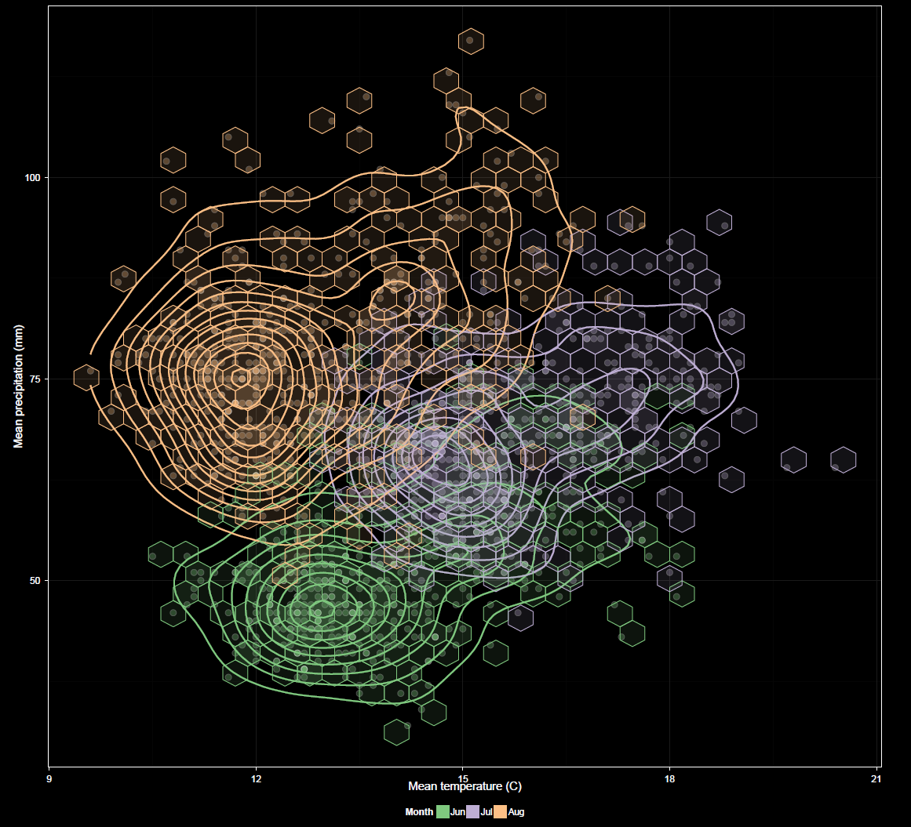

---
output:
  html_document:
    toc: false
    theme: cosmo
    highlight: zenburn
    keep_md: true
---

##
##
### Graphing: Scatter Plots
The scatter plot is the only bivariate plot in the app. Currently it plots temperature vs. precipitation.

##

##

#### X-axis
Axis orientation, currently temperature vs. precipitation or vice versa.
Both variables to be plotted are chosen during data selection and default to `X` and `Y`, respectively but can be swapped here.

#### Grouping
This is similar to grouping for other plots, but applies to both variables.
Grouping is restricted to factors common to both variables.

#### Faceting
This is similar to faceting for other plots, but applies to both variables.
Faceting is restricted to factors common to both variables.

#### Checkbox Options
The `Show CRU 3.2` option overlays CRU in the same manner as in the time series plots.
For the scatter plot, `Show lines` refers to contour lines.
`Hex bins` are also available for the scatter plot. These can assist in visualizing patterns.
Their opacity is based on the amount of data underlying the bins, though this is at a fixed level for CRU data overlays for which varying opacity does not apply.

Other options are similar to those found in other plots.
Log transformations can be applied to X and/or Y variables.
