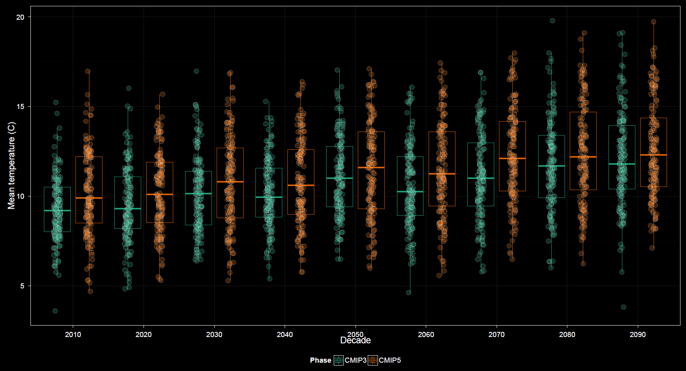

---
output:
  html_document:
    toc: false
    theme: cosmo
    highlight: zenburn
    keep_md: true
---

##
##
### Graphing: A Closer Look at Variability
Variability plot options are somewhat more complex than those for other plots.

##

##

#### X-axis
The x-axis variable may be temporal like in the time series plot or any categorical variable such as in the heat maps.

#### Grouping
This is similar to grouping for other plots.

#### Faceting
This is similar to faceting for other plots.

#### Dispersion statistic
Whereas the heat map plot options offer a choice of statistic, mean or standard deviation, for integrated factor variables to obtain a single aggregate value per cell,
the variability plot strictly offers statistics which measure dispersion. Options include standard deviation, standard error, and full spread, which refers to the magnitude of the range.
The dispersion statistic menu appears when plotting bars showing the magnitude of these measures. By default the `Center on mean` checkbox is unchecked.
Otherwise this menu is replaced with the `Error bars` menu. In this case a line plot is shown and error bars are drawn extending from the line at each axis interval.
Options for error bars include the standard deviation, the standard error, the range, or a 95% confidence interval.
All but the confidence interval are equivalent to the three options available when showing magnitude only via bar plots.

#### Checkbox Options
Options unique to the variability plots include boxplots, which may or may not have points displayed over top.
The `Show CRU 3.2` checkbox includes CRU among GCMs already selected, akin to the heat map, rather than a strict overlay as in the time series plot.
Therefore, in the variability plots inclusion of CRU data is most beneficial when grouping or faceting by model, similar to the case with heat maps.
By default the boxplot option is unchecked and magnitude of variability is shown using a bar plot.
Checking this option has no effect when plotting bars. The `Center on mean` checkbox must also be checked.
Then the scale is that of the data and not of the dispersion measures, and plotting boxplots makes sense as a replacement for the line plots.

#### Details
What makes the plot options somewhat more complex for the variability plots is that more plot subtypes are available.
As a result, menus within the options panel change dynamically based upon certain selections, more so than for previously discussed plots.
As mentioned, a bar plot can display magnitudes of variation, or a line plot can show variation centered around the trend.
Neither the error bar menu or the dispersion statistic menu display if boxplots are shown.
It can take a moment of playing with the options to get a sense for their dynamic relationships in the control panel.

Other options are similar to those found in other plots.
