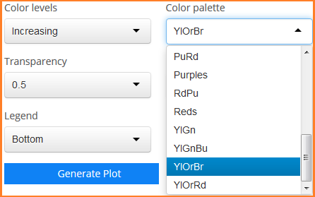

### Graphing: Heat Maps 
Heat maps are univariate like the time series plots in that you can plot one variable at a time, its intensity shown be cell color.

#### X & Y axes
Though univariate in the the above sense, two categorical variables must still be selected for the axes.

#### Grouping
Coloring by factor levels does not apply to heat maps. Color refers to the level of the numeric variable.

#### Faceting 
This is similar to faceting for other plots.

#### Checkbox Options 
Options unique to the heat map include forcing a 1:1 aspect ratio, reversing the color gradient, and displaying values inside cells.
The `Show CRU 3.1` checkbox integrates CRU into any GCMs already selected.
This is not very useful and generally not advisable unless faceting by model in which CRU data appears it its own panel.

Other options are similar to those found in other plots.
