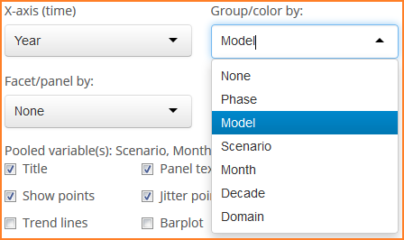

### Graphing: A Closer Look at Variability 

Variability plot options are somewhat more complex than those for other
plots.

#### X-axis

The x-axis variable may be temporal like in the time series plot or any
categorical variable such as in the heat maps.

#### Grouping

This is similar to grouping for other plots.

#### Faceting 

This is similar to faceting for other plots.

#### Checkbox Options 

Options unique to the variability plots include boxplots, which may or
may not have points displayed over top. The `Show CRU 3.1` checkbox
includes CRU among GCMs already selected rather than a stricty overlay
as in the time series plot. Therefore, in the variability plots
inclusion of CRU data is most beneficial when grouping or faceting by
model, similar to the case with heat maps. By default the boxplot option
is unchecked and magnitude of variability is shown using a bar plot.

What makes the plot options somewhat more complex for the variability
plots is that more plot subtypes are available. As a result, menus
within the options panel change dynamically based upon certain
selections, more so than for other plots. When bars are shown, a
checkbox is available to center the data around the mean. Checking this
box changes the plot to a line plot of the original data with different
options for error bars around the mean line at each value along the
x-axis. The error bars are the same as what is otherwise shown in terms
of magnitude of variation when using just a bar plot. This all goes away
is the boxplot option is checked, providing a completely different plot
type and associated options.

Other options are similar to those found in other plots.
