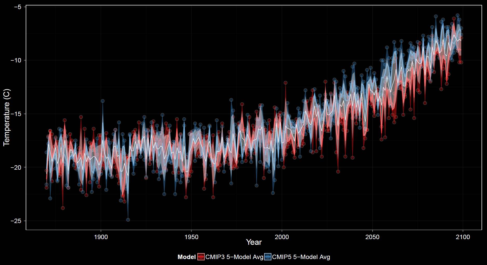
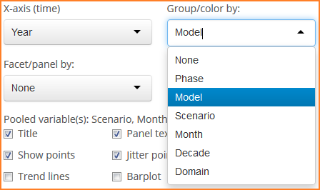
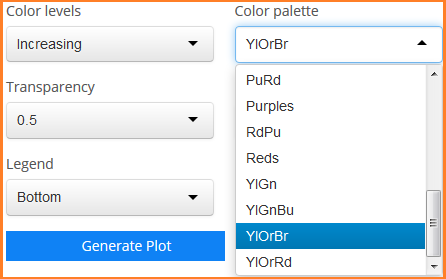

### Graphing: Spatial Distributions 
This group of plots is characteristically different from all previous plots which describe spatially aggregated data through time.
The distributions plots show how data vary across space by way of histograms, density curves, and stripcharts (using boxplots and/or points).
Similar to the variability plots, several options change dynamically based on the subtype of plot selected.
The two main categories of plots are histograms/density curves and stripcharts.

#### X-axis
When plotting histograms and/or density curves, the x-axis must be a numerical variable such as temperature or precipitation. The y-axis is the density of course.
When plotting stripcharts, the x-axis options are similar to those for other plot types. Numeric values are once again along the y-axis.

#### Grouping
This is similar to grouping for other plots.

#### Faceting 
This is similar to faceting for other plots.

#### Checkbox Options 
Options unique to the variability plots include 

Other options are similar to those found in other plots.